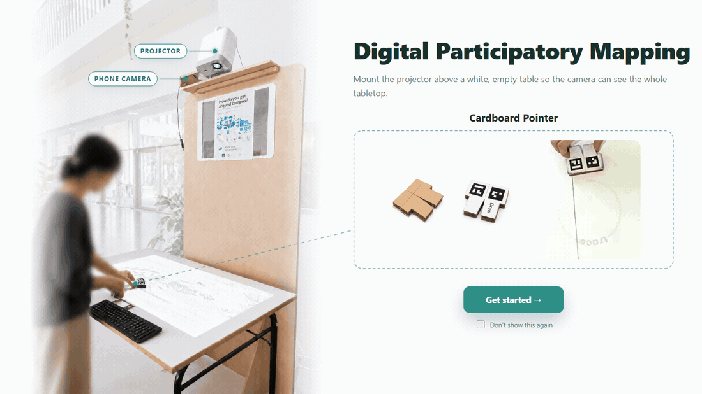

# Low-Barrier Digital Participatory Mapping



This project aims to provide low-cost, easy-to-set-up digital participatory workshops for urban mapping. It uses a video projector, a smartphone camera, and cardboard tokens marked with AprilTags. Participants positioned around the tabletop use these tokens to draw on the map, add comments, and use visualizations tools such as shortest paths and isochrones.

## Setup  

Prebuilt standalone apps are attached to [Releases](../../releases). Unzip
`DigitalMappingWorkshop-windows.zip` and run `DigitalMappingWorkshop.exe`, or
`DigitalMappingWorkshop-macos.zip` and open `DigitalMappingWorkshop.app`. 

## Manual setup

Python 3.11+ recommended.

```
pip install -r requirements.txt
```

```
python app.py --apriltag-family tag16h5
```

Useful arguments:

| Argument | What it does |
|---|---|
| `--source 0` | Camera to use: a webcam index (`0`, `1`, …) or a stream URL. If not provided, the app auto-discovers a phone IP camera on `:8080/video`. |
| `--apriltag-family tag36h11` | Marker family/families to detect (`tag16h5`, `tag25h9`, `tag36h11`, …) and match the tags you printed. Defaults to the marker settings. |
| `--detector aruco` | Detection backend: `pupil` (pupil_apriltags) or `aruco` (default, OpenCV). |
| `--kiosk` | Open the app in fullscreen kiosk mode (no browser chrome). Exit with Alt+F4. |
| `--cloudflare-tunnel` | Start a public Cloudflare tunnel so phones can reach the app from outside the local network. Off by default — everything stays local unless you pass this. |

The server starts at http://127.0.0.1:5000 and opens the home page. Without `--source`
it looks for an IP camera on port 8080 (e.g. a phone camera app) and otherwise starts
without a camera; you can connect one later from the Settings page.


## Why Apriltag Tokens?

[placeholder for image of different tools]

[Why replacing them with one pointer and why not mouse]

[need a video for this: A conventional mouse is designed for a single user positioned in front of a screen  (its left–right and up–down movements are mapped to the screen’s coordinate system. Around a tabletop, participants view the projected map from different angles, so a movement that feels like “left” to one person may correspond to “down” or “right” on the display.] 

## Features
...