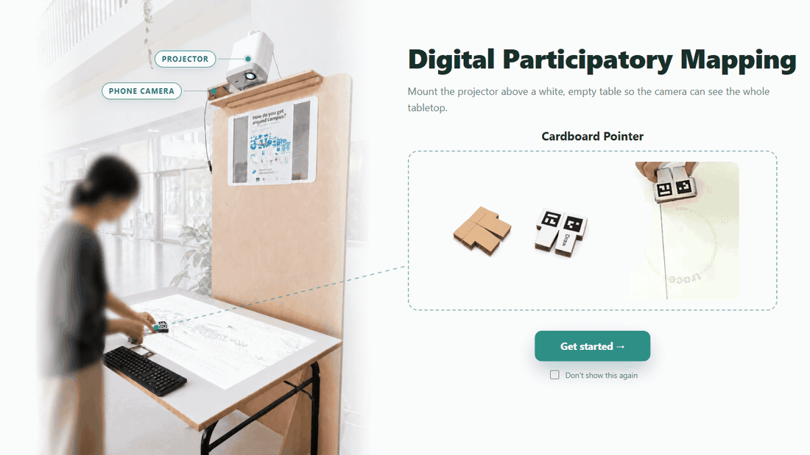
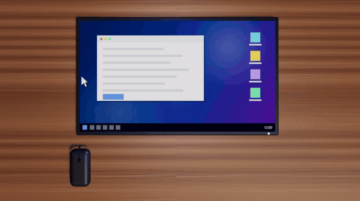
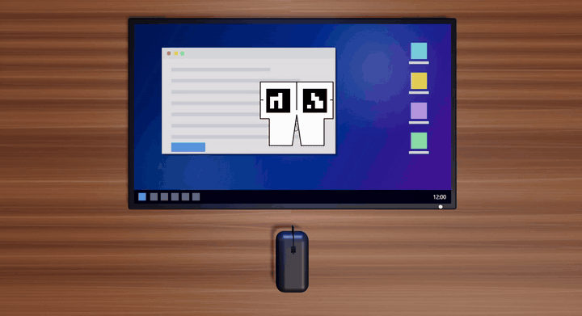

# Low-Barrier Digital Participatory Mapping



This project aims to provide low-cost, easy-to-set-up digital participatory workshops for urban mapping. It uses a video projector, a smartphone camera, and cardboard tokens marked with AprilTags. Participants positioned around the tabletop use these tokens to draw on the map, add comments, and use visualizations tools such as shortest paths and isochrones.

## Setup  

Prebuilt standalone apps are attached to [Releases](../../releases). Unzip
`DigitalMappingWorkshop-windows.zip` and run `DigitalMappingWorkshop.exe`, or
`DigitalMappingWorkshop-macos.zip` and open `DigitalMappingWorkshop.app`. 

## Manual setup

Python 3.11+ recommended.

```
pip install -r requirements.txt
```

```
python app.py --apriltag-family tag16h5
```

Useful arguments:

| Argument | What it does |
|---|---|
| `--source 0` | Camera to use: a webcam index (`0`, `1`, …) or a stream URL. If not provided, the app auto-discovers a phone IP camera on `:8080/video`. |
| `--apriltag-family tag36h11` | Marker family/families to detect (`tag16h5`, `tag25h9`, `tag36h11`, …) and match the tags you printed. Defaults to the marker settings. |
| `--detector aruco` | Detection backend: `pupil` (pupil_apriltags) or `aruco` (default, OpenCV). |
| `--port 5000` | Preferred local port. If it is occupied, the app automatically uses the next available port. Use `--port 0` to let the operating system choose immediately. |
| `--windowed` | Open in a normal browser window. By default the app opens fullscreen (Chrome/Edge app mode, no browser chrome) — F11 or the on-page ⛶ button toggles it. |
| `--cloudflare-tunnel` | Start a public Cloudflare tunnel so phones can reach the app from outside the local network. Off by default — everything stays local unless you pass this. |

The server prefers http://127.0.0.1:5000 and opens the home page. If port 5000 is
already occupied, it automatically selects another available port and opens that
address instead. Without `--source` it looks for an IP camera on port 8080 (e.g. a
phone camera app) and otherwise starts without a camera; you can connect one later
from the Settings page.


## Why Apriltag Tokens?

[placeholder for image of different tools]

### Why a pointer and not a mouse?

<table>
  <tr>
    <th>Mouse</th>
    <th>AprilTag pointer</th>
  </tr>
  <tr>
    <td></td>
    <td></td>
  </tr>
</table>

A mouse is a *relative* device: it reports how far it moved, and the cursor
moves by that amount in the screen's own coordinate system. The pointer is an
*absolute* device: the camera sees where the tag is on the table, so the cursor
is simply the tip of the token. That difference matters for two reasons around
a tabletop.

1. **The cursor is at a fixed offset from the token, so it behaves well for drawing.**

2. **A mouse only works for the person sitting in front of the screen.**


